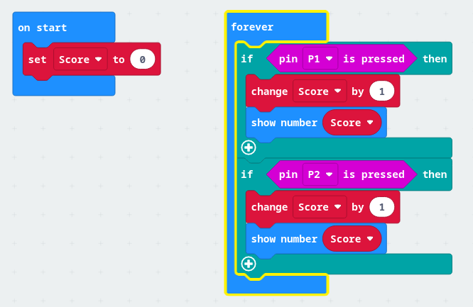
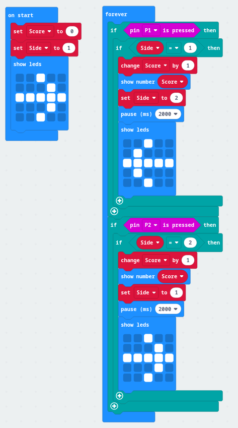
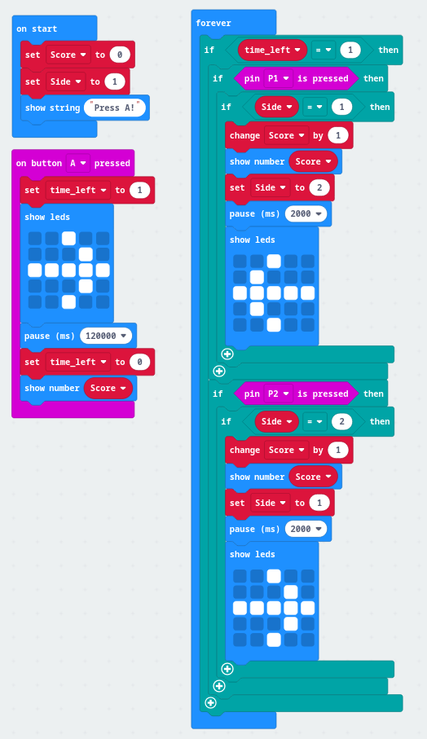

# Maze game

## Game explained
You will have 2 minutes to score points, by pulling on the strings to get the ball from one side of the maze to the other.

After 2 minutes, the players will be given their score and the new game can start. 

## Let's see how the score tracking works

Get a ``||input:pin P1 is pressed||`` block and place it in the value slot of ``||logic:if then||``.

Then add a ``||basic:show number 1||`` to show a tick whenever the condition is true.

``|Download|`` the code to your microbit.
## Connect the cables

Next connect one cable to GND, the other to pin 1.

Touch the 2 cables together. 

You should see a tick mark displayed on the microbit. 

You can try that with a marble wrapped in foil to make sure it works.

## Score!

Let's create a new variable called ``||variable:Score||``.

We need to set the value of the ``||variable: set Score to 0||`` when the game starts.

And each time the pin is pressed, we need to increase the score by 1. 

We can do that with ``||variable: change Score by 1||``.

Instead of showing the number one, let's show the current score.

Replace ``||basic:show number 1||`` with ``||basic: show number Score||``

``|Download|`` the code and see if the number increases each time the cables touch.

## Now repeat for the other goal

Repeat the exercise for pin 2 so that you have both gates working. 

Download the code to the microbit and check that the score is increasing when you connect the cables to pin 2.

You code should look like this:

## Alternating sides

To make it more challenging let's require that a different goal is hit each time.

Create a new variable``||variable: Side||``. Set it's value to ``||variable: set Side to 1||``

Let's draw an arrow to indicate which side needs to be hit first ``||basic:show leds||`` with an arrow pointing right.

## Handling goals

Let's show a different arrow each time the right goal is hit.

First add ``||logic: if Side = 1||`` to the block containing if ``||logic: if pin P1 is pressed||``

Then we need to update the ``||variable: set Side to 2||``.

To indicate which side needs to be hit, let's show an arrow after scoring.

Add a ``||basic: pause (ms) 2000||`` after ``||basic: show number Score||``

Then display an arrow pointing left ``||basic: show leds||``.

``|Download|`` the code and confirm if it works as expected.

If it does, let's repeat for the other side. Don't forget to flip the Side numbers!

## Adding a time limit

At this point you have a working game already, but to make it more exciting let's add a time limit.

To make it more fair, let's have it start once a button is pressed.

Start with ``||input:on button A pressed||``. You can play a melody to indicate that the game is starting at this point. 

Create a new variable ``||variable: time_left||`` and set it's value ``||variable: time_left to 1||``.

Add a ``||basic: pause (ms) 120000||``. This will give the players 2minutes to score as high as they can.

Next let's indicate that the game finished and ``||basic: show number Score||``.

You might want to play a sound here!

## Cleaning up

To avoid confusing players, let's move the arrow from ``||basic:on start||`` to after the button A is pressed.

Instead let's show a message to our players that they need to press A. ``||show string Press A!||``

## Enjoy the game
Let's see how high you can score!

Swap the mazes with other students, see if theirs is easier or harder.

